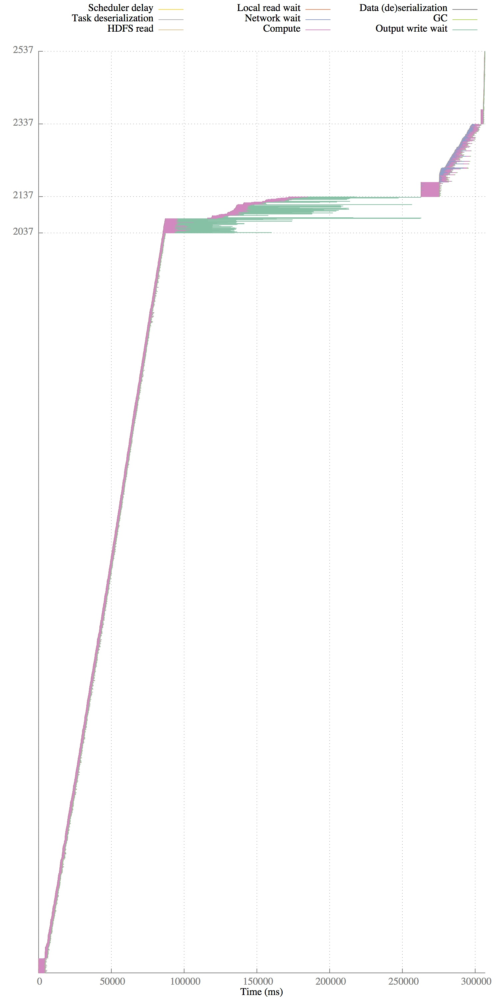

# Understanding Spark Performance

This repository contains scripts to understand the performance of jobs run with [Apache Spark](https://spark.apache.org/).

## Configuring Spark to log performance data

In order to use these tools, you'll first need to configure Spark to log performance data while jobs are running
by setting the Spark configuration parameter `spark.eventLog.enabled` to `true`.  This configuration parameter
causes the Spark master to write a log with information about each completed task to a file on the master. The master
already tracks this information (much of it is displayed in Spark's web UI); setting this configuration option
just causes the master to output all of the data for later consumption.  By default, the event log is written to
a series of files in the folder `/tmp/spark-events/` on the machine where the Spark master runs.
Spark creates a folder within that directory for each application, and logs are stored in a file
named `EVENT_LOG_1` within the application's folder. You can change the parameter
`spark.eventLog.dir` to write the event log elsewhere (e.g., to HDFS).  See the
[Spark configuration documentation](http://spark.apache.org/docs/latest/configuration.html) for more
information about configuring logging.

These scripts are most accurate with more recent versions of Spark because of instrumentation
inaccuracies that were recently fixed (e.g.,
[SPARK-2570](https://issues.apache.org/jira/browse/SPARK-3570) was only included in 1.3.1, and fixes
a problem where not all of the time to write shuffle files to disk was recorded). If you use these
scripts with an older version of Spark, the compute time may include time that was actually spent
doing I/O (in addition to the inaccuracies in compute time mentioned in the
[Missing data](#user-content-missing-data) section).

## Analyzing performance data

After you have collected an event log file with JSON data about the job(s) you'd like to understand, run
the `parse_logs.py` script to generate a visualization of the jobs' performance:

    python parse_logs.py EVENT_LOG_1 --waterfall-only

The `--waterfall-only` flag tells the script to just generate the visualization, and skip more
complex performance analysis. To see all available options, use the flag `--help`.

For each job in the `EVENT_LOG_1` file, the Python script will output a gnuplot file that, when
plotted, will generate a waterfall depicting how time was spent by each of the tasks in the job.
The plot files are named `[INPUT_FILENAME]_[JOB_ID]_waterfall.gp`. To plot the waterfall for job 0, for
example:

    gnuplot EVENT_LOG_1_0_waterfall.gp

will create a file `EVENT_LOG_1_0_waterfall.pdf.  The waterfall plots each task as a horizontal
line.  The horizontal line is colored by how tasks spend time. Tics on the y-axis delineate
different stages of tasks.

Here's an example waterfall:

This waterfall shows the runtime of a job that sorts a small amount of input data. The job has
two stages that each have 40 tasks. The first stage reads input data and saves the data to disk,
sorted based on which reduce task will read the data. Tasks in the second stage read the data
saved by the previous stage over the network and then sort that partition of the data. One thing
that stands out for this job is that tasks in the first stage sometimes spend a lot time writing
output data to disk (shown in teal). In this case, this is because the job was running on top of the
ext3 file system, which performs poorly when writing many small files; once we upgraded to ext4,
the job completed much more quickly and most of the teal-colored time spent writing shuffle output
data disappeared.

Keep in mind that these plots do not depict exactly *when* a task was doing what.  For example, for
the "Output write wait" in the above plot, each task writes output data many times during task
execution, and not only at the very end. Spark only logs the total time spent writing output data,
and does not log exactly when during execution tasks block writing output, because logging the
latter would require saving significantly more information. So, the placement of where in a task's
runtime each component of exeuction is shown in the graph is purely fictional; only the
total amount of time spent in each part of task execution and the start and end time of the task
is accurate.

One thing to keep in mind is that Spark does not currently include instrumentation to measure the
time spent reading input data from disk or writing job output to disk (the ``Output write wait''
shown in the waterfall is time to write shuffle output to disk, which Spark does have
instrumentation for); as a result, the time
shown as `Compute' may include time using the disk. We have a custom Hadoop branch that measures the
time Hadoop spends transferring data to/from disk, and we are hopeful that similar timing metrics
will someday be included in the Hadoop FileStatistics API. In the meantime, it is not currently
possible to understand how much of a Spark task's time is spent reading from disk via HDFS.

## Missing data

Parts of the visualization are currently inaccurate due to incomplete parts of Spark's logging.
In particular, the HDFS read time and output write time (when writing to HDFS) are only accurate
if you are running a special version of Spark and HDFS. Contact Kay Ousterhout if you are interested
in doing this; otherwise, just be aware that part of the pink compute time may be spent read from
or writing to HDFS. (In the future, we're hoping that this time will be exposed in the default
metrics reported by HDFS; see [HADOOP-11873](https://issues.apache.org/jira/browse/HADOOP-11873)
to track progress on adding such metrics.)

Another problem is that the shuffle write time is currently incorrect (it doesn't include much of
the time spent writing shuffle output) for many versions of Spark. [This Spark JIRA search](https://issues.apache.org/jira/browse/SPARK-3570?jql=project%20%3D%20SPARK%20AND%20text%20~%20%22shuffle%20write%20time%22%20AND%20reporter%20in%20(kayousterhout))
tracks the various issues with the shuffle write time.
This will result in the shuffle write time showing up as compute time.

Finally, Spark does not currently expose metrics about the amount of time spent spilling
intermediate data to disk.  Spilling happens when a task uses more memory than is available on the
machine, so needs to temporarily store intermediate data on disk. You can tell if your tasks are
spilling because the stage page in Spark's UI reports the bytes spilled to disk by each task.
Until a fix for [SPARK-3577](https://issues.apache.org/jira/browse/SPARK-3577) is merged, spill
time is not logged by Spark tasks, so time spent spilling data to disk will show up as compute
time.

## FAQ

#### How do I upgrade my version of gnuplot to support generating PDF output?

The gnuplot file generated by these scripts uses the pdfcairo terminal device to generate
slightly nicer looking files, but many versions of gnuplot (especially on macs) do not include
pdfcairo by default.

If you'd like a quick fix to this problem, you can just change the gnuplot file generated
by the scripts to generate postscript output instead of pdf output.  To do this, change the
line at the top that reads `set terminal pdfcairo ...` to instead say `set terminal postscript ...`,
and at the very bottom of the file, change the line that reads `set output X.pdf` to instead say
`set output X.ps`.  This graph won't look quite as nice, but you can get a very basic version
working.

For mac users, to update your version of gnuplot to include pdfcairo, I recommend first
uninstalling your current version of gnuplot, and then using [Homebrew](http://brew.sh/) to install
gnuplot with pdfcairo enabled:

    brew install gnuplot --cairo --pdf --tutorial

I've found that trying to upgrade existing versions of gnuplot to include pdfcairo is much more
difficult than just re-installing gnuplot.

In theory, you can also use macports to install gnuplot with pdfcairo
(described [here](http://youinfinitesnake.blogspot.com/2011/02/attractive-scientific-plots-with.html))
but I've found that this often fails.

####This graph is way too hard to read! How do I make it bigger?

The first line of the gnuplot file includes a size (by default, `size 5,5`). The two coordinates
describe the length and width; increase these to generate a larger graph.

####I'm getting an error that says "'AttributeError: 'module' object has no attribute 'percentile'"

If you get an error that ends with:

    median_runtime = numpy.percentile(runtimes, 50)
    AttributeError: 'module' object has no attribute 'percentile'

you need to upgrade your version of `numpy` to at least 1.5.

####Parts of my plot are outside of the plot area, and/or some tasks seem to be overlapping others.

This typically happens when you try to plot multiple gnuplot files with one command, e.g.,
with a command like:

    gnuplot *.gp

Gnuplot will put all of the data into a single plot, rather than in separate PDFs.  Try plotting
each gnuplot file separately.

#### How can I figure out which parts of the code each stage executes?

While a common cause of confusion in Spark, this question is unfortunately not answered by this
tool.  Right now, the event logs don't include this information.  There have been murmurs about
adding more detail about this to the Spark UI, but as far as I know, this hasn't been done yet.

#### The scheduler delay (yellow) seems to take a large amount of time. What might the cause be?

At a very high level, usually the best way to reduce scheduler delay is to consolidate jobs into
fewer tasks.

The scheduler delay is essentially message propagation delay to (1) send a message from the
scheduler to an executor to launch a task and (2) to send a message from the executor back to the
echeduler stating that the task has completed.  This can be high when the task is large or the task
result is large, because then it takes longer for the scheduler to ship the task to the executor,
and vice versa for the result. To diagnose this problem, take a look at the Spark UI (or directly
look at the JSON in your event log) to look at the result size of each task, to see if this is
large.

Another reason the scheduler delay can be high is if the scheduler is launching a large number of
tasks over a short period.  In this case, the task completed messages get queued at the scheduler
and can't be processed immediately, which also increases scheduler delay.  When I've benchmarked
the Spark scheduler in the past, I've found it can handle about 1.5K tasks / second (see section 7.6
in [this paper](http://delivery.acm.org/10.1145/2530000/2522716/p69-ousterhout.pdf). This was for
a now-antiquated version of Spark, but in theory this shouldn't have changed much, because the Spark
performance regression tests run before each release have a test that measures this.

One last reason we've sometimes seen in the AMPLab is that it can take a while for the executor to
actually launch the task (which involves getting a thread -- possibly a new one -- from a thread
pool for the task to run in).  This is currently included in scheduler delay.  A few months ago,
I proposed adding metrics about this to the Spark UI, but it was deemed too confusing and not
useful to a suffuciently broad audience (see
discussion here: https://github.com/apache/spark/pull/2832).  If you want to understand this
metric, you can implement the reverse of 
[this commit](https://github.com/kayousterhout/spark-1/commit/531575d381b5e4967d5b2f4385c5135040f98165)
(which is part of the aforementioned pull request) to measure whether this time is the cause of the
long scheduler delay.

